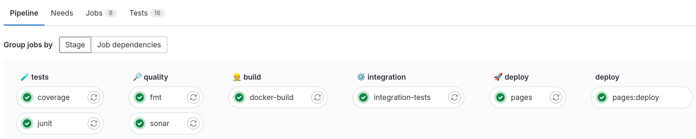
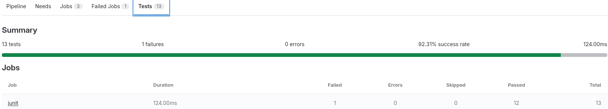
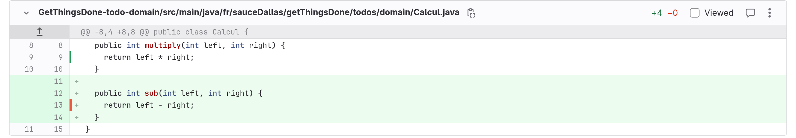

# Garantir la qualité logicielle : gestion des tests et respect des règles de développement

L'objectif de ce TP est d'obtenir le pipeline suivant : 



## Q1 - Tester les jobs en local

Le dernier TP vous a poussé à faire de très nombreux commits pour tester vos modifications de pipeline, ce qui prend du temps à chaque changement. Or il est possible de tester au moins une partie du pipeline en local. Pour cela,

* Démarrez votre VM Vagrant
* Installez gitlab-runner dans votre VM en suivant les [instructions fournies par gitlab](https://docs.gitlab.com/runner/install/linux-repository.html)
* Ajouter un job `hello-world` dans votre pipeline

```yaml
hello-world:
  image: debian
  script:
    - echo "Hello World!"
```
* Tester le job en question avec la commande `gitlab-runner exec docker hello-world`

Vous devriez obtenir un affichage semblable à cela :
```
$ echo "Hello World!"
Hello World!
Job succeeded
```

Tester en local vous permet de

* valider la syntaxe de votre fichier .gitlab-ci.yml
* de vérifier les output de vos jobs
* et donc d'éliminer une bonne partie des commits du genre 'j'ai oublié un point virgule' 

Mais ne permet pas :

* de tester l’enchaînement de plusieurs jobs
* de tester les uploads

## Q2 - Lancer les tests unitaires
Comme expliqué en cours, un des objectifs de la chaîne d'intégration et de déploiement continu consiste à lancer l'ensemble des tests à chaque commit. 

* Ajouter une étape (stage) `🧪 tests` à votre pipeline. Cette étape est un préalable aux autres étapes. Si elle échoue, les autres étapes ne doivent pas être exécutées.
* Ajouter un job nommé `junit` associé à cette étape `🧪 tests`. Ce job lancera les tests au moyen de la commande `mvn test`
* Vous pouvez alors voir dans les logs du job  : 
```
[INFO] --- surefire:2.22.2:test (default-test) @ GetThingsDone-app ---
[INFO] ------------------------------------------------------------------------
[INFO] Reactor Summary for GetThingsDone 1.0-SNAPSHOT:
[INFO]
[INFO] GetThingsDone ...................................... SUCCESS [  0.002 s]
[INFO] GetThingsDone-todo-domain .......................... SUCCESS [ 16.717 s]
[INFO] GetThingsDone-infra ................................ SUCCESS [ 25.282 s]
[INFO] GetThingsDone-app .................................. SUCCESS [  8.015 s]
[INFO] ------------------------------------------------------------------------
[INFO] BUILD SUCCESS
[INFO] ------------------------------------------------------------------------
```
* Ajouter le test suivant dans le fichier `GetThingsDone-todo-domain/src/test/java/fr/sauceDallas/getThingsDone/todos/domain/validators/TitleValidatorTest.java`

```java
    @Test
    public void testThatWontWork() {
	    assertThat(TitleValidator.validate("   ")).isEmpty();
    }

```
 * Vérifier que la chaine de CI/CD s'arrête bien quand les tests échouent.

## Q3 - Ajouter le reporting Junit

Dans la question précédente, votre pipeline s'est arrêté parce qu'un test à échoué. Si vous voulez connaître le détail des erreurs générées par les tests, vous êtes obligé·e d'afficher le log du job correspondant et de retrouver l'erreur, ce qui n'est pas très pratique.

Pour rendre les choses plus faciles, nous allons intégrer à gitlab le rapport généré par Junit.

* en vous aidant de la [documentation sur les rapports Junit](https://docs.gitlab.com/ee/ci/testing/unit_test_reports.html), ajoutez la récupération du rapport de test à votre job  `Junit`.

Les rapports de tests sont des fichiers XML générés par Junit (la [documentation du plugin `surefire`](https://maven.apache.org/surefire/maven-surefire-plugin/index.html) vous indiquera où ces fichiers sont générés).

Si tout se passe bien vous devriez obtenir le résultat suivant en allant dans `Build > Pipeline`  et en allant sur l'onglet `test` de la dernière exécution :



En cliquant sur le nom du job, vous pourrez accéder au détail des tests et de leurs résultats.

## Q4 - Couverture de test

Afin de voir le badge de couverture de tests ainsi que le suivi de la couverture de tests (Analyse > Repository analytics) et le diff enrichi dans les Merges Request, nous allons ajouter la couverture de test.

### Q4.1 - Le badge de couverture de test

* Ajouter le badge de couverture de test
* Le plugin maven `jacoco` a déjà été configuré, vous pouvez visiter le site `GetThingsDone-aggregate/target/site/jacoco-aggregate/index.html` après avoir lancé la commande `mvn verify`

🦮 - La documentation officielle de gitlab sur les badges : https://docs.gitlab.com/ee/user/project/badges.html

N'oubliez pas, la directive `coverage` du fichier `.gitlab-ci.yml` exploite le stdout du script du job.

### Q4.2 - La visualisation de la couverture de test

* Ajouter la visualisation dans l'IHM de gitlab de la couverture de test.
* Tester en faisant une merge request qui ajoute une classe toute simple et sa classe de test dans le domain avec seulement 1 méthode sur 2 de testé.

Si tout ce passe bien, vous devriez obtenir ça en allant regarder votre Merge Request 



🦮 : 
- La documentation officielle de gitlab : https://docs.gitlab.com/ee/ci/testing/test_coverage_visualization.html
- La documentation jacoco2cobertura : https://gitlab.com/haynes/jacoco2cobertura

## Q5 - Se brancher sur un Sonar

Afin de lancer l'analyse de code statique à chaque commit, nous allons nous brancher sur un serveur [Sonarqube](https://sonarsource.com).

* Ajouter un job `sonar` dans une étape `🔎 quality` qui ne se lance que si le job `junit` se termine bien
* Pour ce faire, vous aurez probablement besoin des paramètres suivant : 
    * Token : `squ_776e4f6a126f456d8341972950fe32916f858122`
    * Serveur sonar : https://sonar.aqoba.fr
    * organisation : fr.univlille
* Le nom de votre projet sera configuré à `nom.prenom:${project.artifactId}` grâce au paramètre `sonar.projectKey` 
* Et sera affiché dans la liste sous la forme `Nom Prénom`
* Veillez à bien remonter les informations de couverture de code, n'oubliez pas que le rapport de couverture de test est généré et aggrégé dans le module `GetThingsDone-aggregate` autrement dit chaque module va pouvoir lire le fichier `../GetThingsDone-aggregate/target/site/jacoco-aggregate/jacoco.xml`
* Enfin voici le compte sonar que vous pouvez utiliser : r504 / caichai8uiphoh3ke2As

🦮 :
- La documentation de sonarqube : https://docs.sonarsource.com/sonarqube/latest/analyzing-source-code/scanners/sonarscanner-for-maven/
- La documentation des paramètres : https://docs.sonarsource.com/sonarqube/latest/analyzing-source-code/analysis-parameters/

## Q6 - Badges

Afin d'avoir une vision synthétique du pipeline et des éléments clé de sonar, nous allons ajouter quelques badges.

* Ajouter le badge de pipeline. Au clic sur le badge on doit être redirigé vers la page "Build > Pipelines"
* Ajouter les badges sonar suivant : 
    * le nombre de bugs
    * le nombre de vulnérabilités
    * le nombre de bad smells

🦮 : 
- La documentation officielle de gitlab sur les badges : https://docs.gitlab.com/ee/user/project/badges.html
- Les badges sonar se trouvent dans "Project Information"

## Q7 - Tests d'intégration

Le projet ... contient quelques tests d'intégration rédigés en JUnit faisant des appels sur notre superbe API `/todos/`. L'objectif est de jouer ces tests d'intégration après le build du container.

### Q7.1 Lancer les tests en local

Pour lancer les tests d'intégration en local, il faut : 
* lancer l'application en local avec le docker-compose
* vous déplacer dans le module `integration-tests`
* exporter la variable `BASE_URL` avec l'URL de base `http://localhost:8080`
* puis lancer la commande `mvn test`, vous devriez voir : 
```
[INFO] Tests run: 2, Failures: 0, Errors: 0, Skipped: 0, Time elapsed: 0.834 s -- in fr.sauceDallas.getThingsDone.todos.IntegrationTests
[INFO]
[INFO] Results:
[INFO]
[INFO] Tests run: 2, Failures: 0, Errors: 0, Skipped: 0
[INFO]
[INFO] ------------------------------------------------------------------------
[INFO] BUILD SUCCESS
[INFO] ------------------------------------------------------------------------
[INFO] Total time:  4.152 s
[INFO] Finished at: 2023-11-18T19:48:57+01:00
[INFO] ------------------------------------------------------------------------
```
* En visitant le http://localhost:8080/todos/ vous devriez voir une liste non vide.

### Q7.2 Lancer les tests dans le pipeline

En vous inspirant du docker-compose.yml construire un job `integrationt-tests` à l'étape `⚙️  integration`, n'oubliez pas d'uploader les résultats des nouveaux tests pour le rapport de tests.

🦮 - La documentation de référence : https://docs.gitlab.com/ee/ci/services/

## Q8 - Formatage du code

Pour ne pas avoir des diffs de commits énormes liés à des formatages différents, nous allons ajouter le plugin `fmt-maven-plugin` et configurer le job `fmt` de la façon suivante :

* Formatage du code automatique à la compilation.
* Le job `fmt` dans l'étape ̀`🔎 quality` passe en échec si le formatage du code produit un diff sur la base de code.

🦮 - Le plugin maven de formatage de référence : https://github.com/spotify/fmt-maven-plugin

